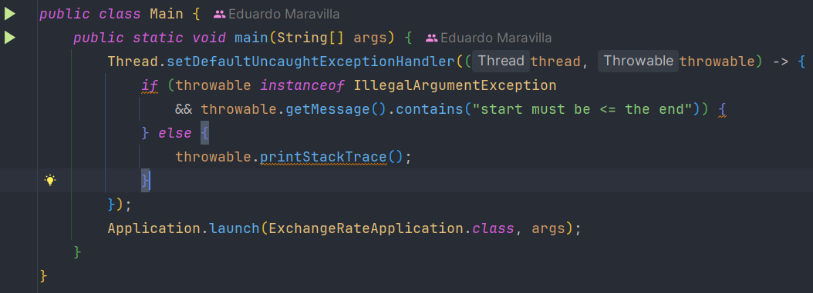
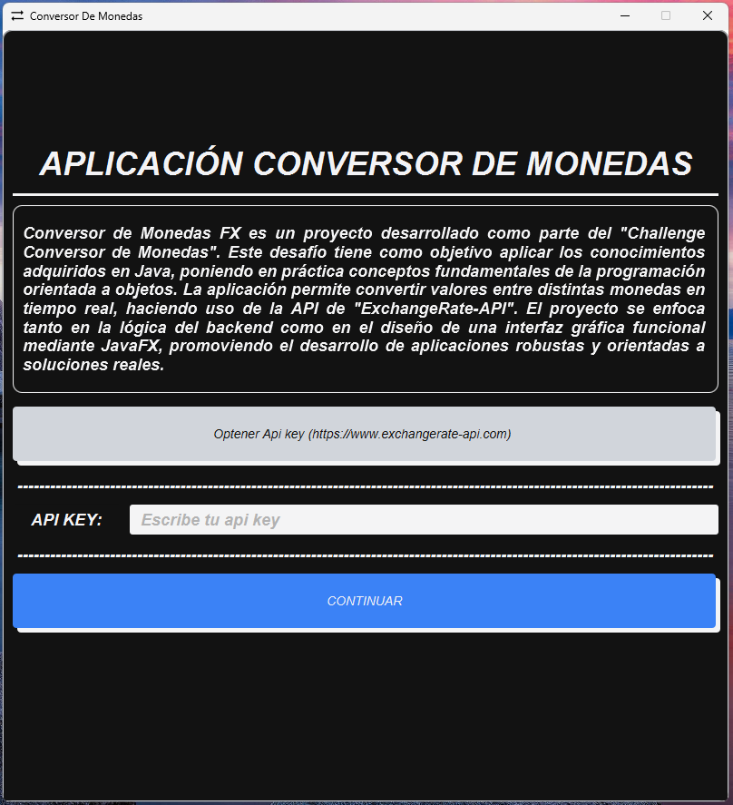
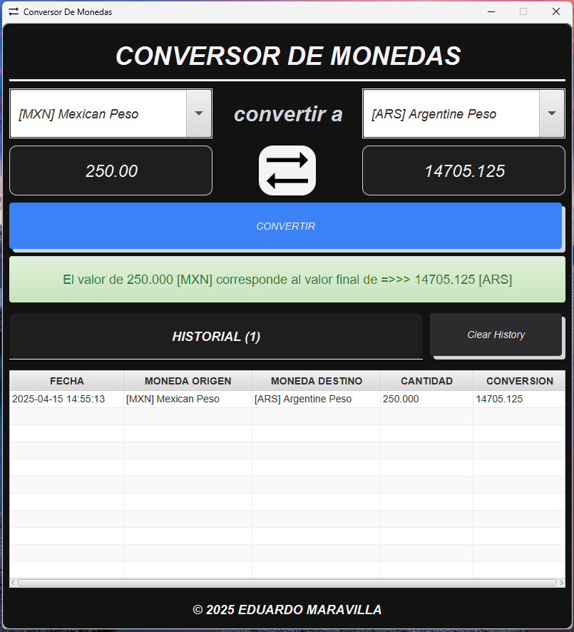

## 📌 Ejemplo de Uso

1. Abre el proyecto con **IntelliJ IDEA**.
2. Ejecuta la clase `Main`:

   

3. Ingresa tu `API KEY` en el campo correspondiente y haz clic en **Continuar**:

   

   > **Nota:** si la API key no es válida, no podrás avanzar desde esta página.

4. Rellena los campos requeridos y obtén tu conversión:

   

---

### 🔍 Detalles

- Soporta todas las monedas proporcionadas por [**ExchangeRate API**](https://app.exchangerate-api.com/)
- El historial guarda hasta **500 conversiones**
- Muestra mensajes detallados en caso de errores
- Es necesario tener conexión a internet para su funcionamiento
