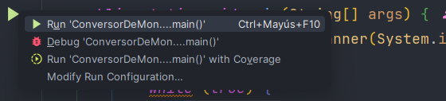
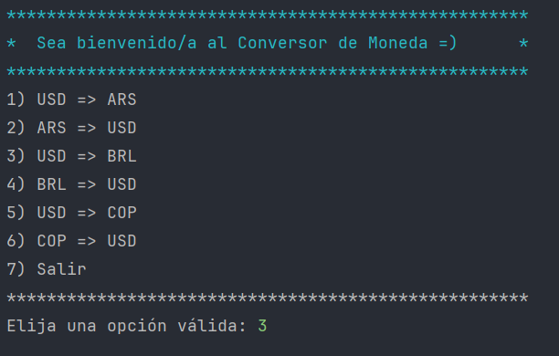
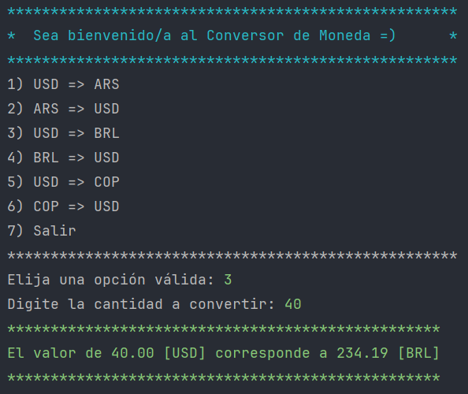

## 📌 Ejemplo de Uso

1. Abre el proyecto con **IntelliJ IDEA**.
2. Navega hasta la clase `ExchangeRateApi`.
3. Escribe tu `API KEY` en el campo correspondiente:

   

4. Ejecuta la clase `Main`:

   

5. Selecciona una opción del menú:

   

6. Ingresa la cantidad a convertir y obtén el resultado:

   
